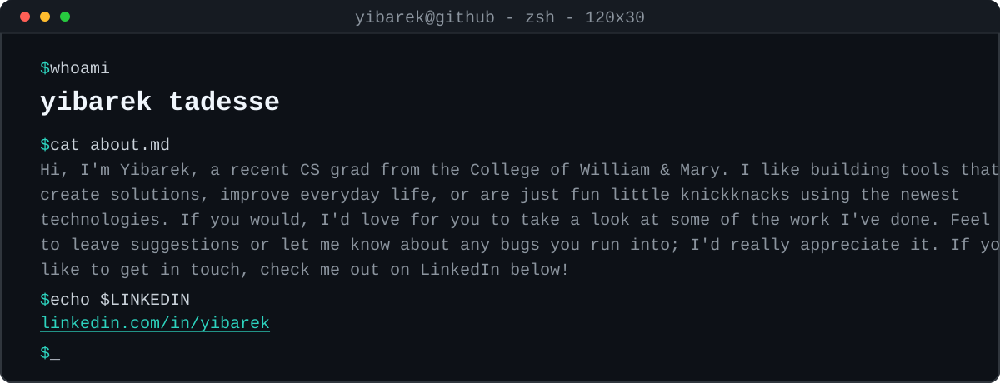

<a href="https://www.linkedin.com/in/yibarek/">
<picture>
  <source media="(prefers-color-scheme: dark)" srcset="assets/banner-dark.svg">
  <source media="(prefers-color-scheme: light)" srcset="assets/banner-light.svg">
  
</picture>
</a>

## Projects

<table>
<tr>
<td width="50%" valign="top">

### [twitter_GC_archival](https://github.com/yib7/twitter_GC_archival)

Fully offline viewer for Twitter/X group-chat exports: fuzzy search,
timeline, media gallery, stats, and a year-in-review Wrapped. No server,
no build step, no dependencies.

  

</td>
<td width="50%" valign="top">

### [STATlee](https://github.com/yib7/STATlee)

Describe an analysis in plain English. STATlee generates runnable Python or R,
moderates it, runs it in a Docker sandbox, and explains the results.
Full web app: auth, billing, rate limiting, streaming output.

   

</td>
</tr>
<tr>
<td width="50%" valign="top">

### [INployed](https://github.com/yib7/INployed)

Job discovery, end to end: a scheduled cloud scraper feeds a two-stage LLM
scorer and a desktop dashboard, and a LaTeX engine tailors the resume for
each posting without fabricating a word.

   

</td>
<td width="50%" valign="top">

### [xeno-series-rag](https://github.com/yib7/xeno-series-rag)

Local-first RAG chatbot over the 36k-article Xeno Series Wiki. Hybrid
dense + BM25 retrieval with reranking; every answer cites the wiki pages
it came from. Evaluated against a 200-question gold set.

  

</td>
</tr>
<tr>
<td width="50%" valign="top">

### [LeetCoach](https://github.com/yib7/LeetCoach)

Paste a LeetCode problem, get study material in three depths, streamed as
it generates. It drives the Claude CLI instead of an API key, and verifies
every code sample in a Python sandbox before you see it.

   

</td>
<td width="50%" valign="top">

### [pretrain-or-prompt](https://github.com/yib7/Strats-for-Bug-Fixing)

Four-arm study: does pretraining a small T5 beat prompting or LoRA-adapting
a bigger code LLM at fixing Java bugs? Scored on CodeBLEU and on whether the
patch compiles and passes JUnit. Execution inverts the ranking. LoRA wins
CodeBLEU at 0.854 but RAG fixes more real bugs, 35.8% of 201.

    

</td>
</tr>
</table>

### Smaller projects

[**Lumen**](https://github.com/yib7/Lumen) is a CPU raytracer in C with recursive
reflections, shadows, and anti-aliasing; OpenMP takes a 1200x900 render from 3.7s
to 0.5s. [**Tessera**](https://github.com/yib7/Tessera) is a Java 21 Swing memory
game: tile themes, skill-based scoring, a persistent leaderboard, and a
double-click jar. [**clicker_snail**](https://github.com/yib7/clicker_snail)
records, tests, and schedules mouse and keyboard sequences on Windows.

## Stack

**Languages**

     

**Frameworks and libraries**

              

**Infrastructure and APIs**

      

## By the numbers

  

<picture>
  <source media="(prefers-color-scheme: dark)" srcset="assets/lang-dna-dark.svg">
  <source media="(prefers-color-scheme: light)" srcset="assets/lang-dna-light.svg">
  
</picture>

---

The banner is hand-rolled SVG. View source in this repo: <a href="assets/banner-dark.svg">assets/banner-dark.svg</a>.
